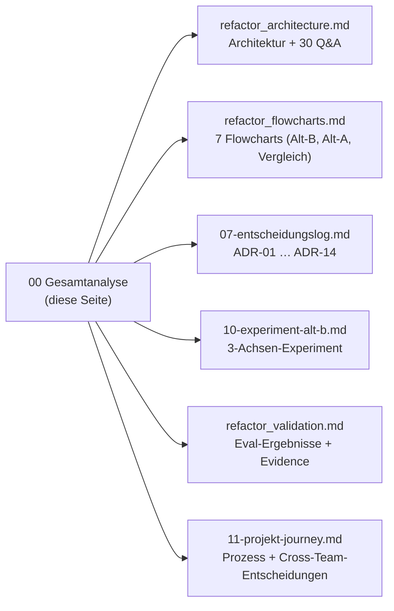

# 00. Gesamtanalyse (Präsentations-Einstieg)

> **Eine Seite, die alles verbindet.** Start hier für die Präsentation; jeder Block verlinkt das Detail-Dokument.

## Forschungsfrage
Wie gut übersetzt ein **lokales LLM** (Ollama, qwen3:14b) **Freitext** in **belastbare Outputs** — und wie
stark halluziniert es dabei, verglichen mit einer **rein deterministischen** Berechnung? Untersucht über zwei
vergleichbare Agenten (**Alt-A** deterministisch, **Alt-B** NL-Freitext) auf gemeinsamer Basis.

## Kernaussagen (Executive Summary)
- **Gemeinsames Prinzip beider Alternativen:** *Determinismus als Rückgrat, LLM eingehegt* (Hybrid-Agent, ADR-07).
- **Alt-A:** der **Code entscheidet** (gewichtetes Ensemble → BUY/HOLD/SELL), das **LLM erklärt** nur
  (Evidence-Gate). Voll reproduzierbar. *Eingefrorene v2.0-Baseline.*
- **Alt-B (unser Fokus):** das **LLM beurteilt** ein **konfigurierbares Freitext-Kriterium** gegen aktuelle
  News — **begrenzt durch einen Clamp** (Regex-Basis ±1), Decision-Trace, `fast`/`agentic`-Modus.
- **Messbares Ergebnis (Alt-B-Validierung, 36 Läufe):** Trefferquote **83 %** (fast 78 % / agentic 89 %),
  **0 Halluzinationen** (3 vom Clamp geblockt). ⚠️ *Stand vor dem `think:false`-Fix; Re-Run ausstehend —
  erwartete Verbesserung bei fast-Genauigkeit + Latenz.*

## Projektkarte (wo steht was?)

## Alt-A vs. Alt-B — der Vergleich
*(Diagramm: [refactor_flowcharts.md](refactor_flowcharts.md) → Flowchart 7.)*

| | **Alt-A** (DS-Ziel) | **Alt-B** (NL-Ziel) |
|---|---|---|
| Zusatz-Ziel | Data-Science (Ensemble; „Bollinger > x" konzeptionell) | **konfigurierbares Freitext-Kriterium** |
| Wer entscheidet | **Code** (reine Funktion, reproduzierbar) | **LLM**, begrenzt durch **Clamp** (Regex ±1) |
| LLM-Rolle | erklärt das Ergebnis (+ News-Sentiment) | **beurteilt** das Kriterium |
| Halluzinationsschutz | Evidence-Gate (Zahlen) | Clamp (Stärke) + Beleg-Pflicht |
| Reproduzierbar | ✅ exakt | ⚠️ LLM (T=0), per Clamp gebunden |
| Aufruf | pro Ticker (`/api/agent/analyze/{ticker}`) | pro Ticker **+ Kriterium** (`/api/agent/nl-target`) |
| Evaluation | Walk-Forward-Backtest + Faithfulness-Rate | 36-Fälle-Harness (Urteilsqualität, Clamp, Latenz) |
| Status | eingefrorene v2.0-Baseline | aktiver Strang (dieser Branch) |

**Vergleichbarkeit:** beide teilen Stack, Datenquellen, Hybrid-Philosophie und Anti-Halluzinations-Idee.
Bewusst variiert wird **nur der Ziel-Typ** — und damit, **wo** das LLM sitzt (erklären vs. entscheiden-begrenzt).

## Was getestet wurde — und was nicht
- ✅ **Getestet:** Freitext-Urteilsqualität, Halluzinationsschutz (Clamp), `fast` vs. `agentic`, konfigurierbares Ziel.
- ❌ **Nicht getestet:** Trading-Performance/Renditen, statistische Repräsentativität (n=18), modusübergreifender Determinismus.
*(Details + Musterantworten: [refactor_validation.md](refactor_validation.md), [refactor_flowcharts.md](refactor_flowcharts.md) → Flowchart 5.)*

## Ausblick (nächste Schritte)
- `think:false`-Fix evaluieren (Re-Run) → fast-Genauigkeit + Latenz quantifizieren.
- Decision-Trace tiefer in den NL-Agent ziehen; Regex-vs-LLM-Divergenz als explizite Metrik.
- Weitere NL-Quellen (Reddit) hinter `NLItem`; Multi-Agent (Achse C) als dokumentierte Zukunft.

## Verteidigung (Schnellzugriff)
30 vorbereitete Professorenfragen + Musterantworten: [refactor_architecture.md](refactor_architecture.md) §11.
Empfohlene Folienreihenfolge: [refactor_flowcharts.md](refactor_flowcharts.md) → „Empfehlungen für Dienstag".
