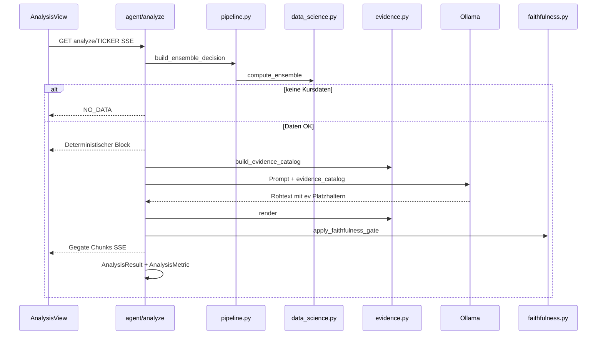

# 9. Release v2.0-baseline — Changelog, Stand & Fortführung

> **Zweck dieses Dokuments:** Lückenloses Protokoll der Baseline-Stabilisierung (Juni 2026).
> Enthält: Was war kaputt, was wurde gebaut, wie es funktioniert, Git-Branching für die
> Strategie-Teams, und eine **Vorlage**, wie ihr künftige Änderungen dokumentiert.

**Git-Referenz:** Tag `v2.0-baseline` · Commit `a17cab7` auf `main`  
**Datum:** 2026-06-04 (Baseline-Merge & Push)

---

## 1. Executive Summary

Version **v2.0-baseline** macht PortfAIo **lauffähig, nachvollziehbar und teamfähig**:

| Vorher (Problem) | Nachher (Lösung) |
|------------------|------------------|
| Backend startete nicht (`eval/` fehlte) | Paket `backend/eval/` + Router `/api/eval/*` |
| Frontend-Build brach ab (ChatView, EvalView, useMarkdown) | Alle 7 Views bauen |
| LLM erfand Kurse/RSI in Erklärungen | Evidence-Katalog + Faithfulness-Gate |
| Analyse bei fehlenden Daten erfunden | **NO_DATA**-Abbruch ohne LLM |
| Kein messbarer Qualitäts-Check | `AnalysisMetric` + Eval-UI + Backtest |
| Ein Branch für alle | `main` / `develop` / zwei Feature-Branches für Strategietests |

**Kernprinzip unverändert:** BUY/HOLD/SELL kommt aus `compute_ensemble()` — **nicht** aus dem LLM.
Neu ist die **abgesicherte Erklärungsschicht** (Phase 4).

---

## 2. Chronologie (was wann passiert ist)

```
e7aadcb  Anlage Empfehlung überarbeitet (Agent-Modus, Chat/Rebalance-Endpoints)
    …      Zwischenstand: eval/ + Views referenziert, aber nicht committed → App kaputt
a17cab7  Stabilize baseline: evidence gate, eval module, missing views  ← v2.0-baseline
         Tag v2.0-baseline · Branches develop, feature/strategy-alt-a/b
```

---

## 3. Neu hinzugekommene Dateien

### Backend

| Datei | Rolle |
|-------|-------|
| [`backend/agent/evidence.py`](../backend/agent/evidence.py) | Evidence-Katalog aus Pipeline; `{{ev:id}}`-Rendering |
| [`backend/eval/__init__.py`](../backend/eval/__init__.py) | Eval-Paket |
| [`backend/eval/faithfulness.py`](../backend/eval/faithfulness.py) | Satz-Gate gegen Halluzinationen |
| [`backend/eval/backtest.py`](../backend/eval/backtest.py) | Walk-Forward-Backtest des Ensembles |
| [`backend/routers/eval.py`](../backend/routers/eval.py) | HTTP: `/api/eval/metrics`, `/api/eval/backtest` |
| [`backend/tests/test_evidence_faithfulness.py`](../backend/tests/test_evidence_faithfulness.py) | 5 Unit-Tests (Evidence + Gate) |

### Frontend

| Datei | Rolle |
|-------|-------|
| [`frontend/src/views/ChatView.vue`](../frontend/src/views/ChatView.vue) | KI-Chat (EventSource → `/api/agent/chat`) |
| [`frontend/src/views/EvalView.vue`](../frontend/src/views/EvalView.vue) | Metriken + Backtest-UI |
| [`frontend/src/composables/useMarkdown.ts`](../frontend/src/composables/useMarkdown.ts) | Markdown-Rendering für Agent-Output |

---

## 4. Geänderte Dateien (kurz)

| Datei | Änderung |
|-------|----------|
| [`backend/agent/orchestrator.py`](../backend/agent/orchestrator.py) | NO_DATA, Evidence-Prompt, gated Erklärung, Metriken mit Katalog |
| [`backend/agent/pipeline.py`](../backend/agent/pipeline.py) | `has_price_data` im Context |
| [`backend/agent/prompts.py`](../backend/agent/prompts.py) | Nur `{{ev:id}}`-Zahlen; Signal begründen, nicht überstimmen |
| [`.gitignore`](../.gitignore) | `.idea/`, `__pycache__/`, `.venv/` |
| [`docs/03-agent-design.md`](03-agent-design.md) | Phase 4 Evidence-Gate, agentic default |
| [`docs/07-entscheidungslog.md`](07-entscheidungslog.md) | ADR-11, ADR-12 |
| [`docs/08-api-referenz.md`](08-api-referenz.md) | Eval-Endpunkte |
| [`CLAUDE.md`](../CLAUDE.md) | Struktur, Modell `qwen3:14b`, Branches |

---

## 5. Architektur: Analyse-Ablauf (v2.0)



### 5.1 Evidence-Katalog (`agent/evidence.py`)

Jede **kanonische Zahl** aus der Pipeline bekommt eine stabile ID:

| ID (Beispiele) | Quelle |
|----------------|--------|
| `score`, `confidence`, `signal` | `EnsembleDecision` |
| `comp_*`, `contrib_*` | Komponenten-Breakdown |
| `rsi_14`, `sma_50`, `sma_200`, `macd`, … | `decision.technicals` |
| `pe_ratio`, `market_cap`, … | `context.fundamentals` |
| `news_sentiment` | Sentiment-Score |
| `unrealized_pnl_pct`, `portfolio_weight` | Portfolio-Kontext |

**LLM-Regel:** Zahlen nur als `{{ev:rsi_14}}` — nie frei tippen.

**Render:** `render(text, catalog)` ersetzt Platzhalter durch echte Werte. Unbekannte ID → `[[?ev:…]]`.

### 5.2 Faithfulness-Gate (`eval/faithfulness.py`)

Pro **Satz** drei Prüfungen:

1. Unbekannte `{{ev:…}}` / `[[?ev:…]]` nach Render → Satz entfernt  
2. **Label-Violations:** „RSI 72" muss zu `ev:rsi_14` passen (Toleranz ±1,5 bzw. 2 %)  
3. **Unbacked numbers:** Jede nackte Zahl muss einem Evidence-Wert entsprechen  

Fail → `⚠️ _[Aussage ohne Evidence entfernt]_`

**Trade-off:** Erklärung wird **non-stream** geholt, gegated, dann in Chunks gesendet (kurzer Delay, dafür keine Live-Halluzinationen).

### 5.3 NO_DATA

Wenn `context.has_price_data == false` (keine Kurszeitreihe):

- Kein LLM-Aufruf  
- Keine erfundene Empfehlung  
- UI zeigt: „Keine Analyse möglich … Ticker prüfen / Daten vorbereiten"

### 5.4 Eval & Backtest

- **`GET /api/eval/metrics`** — letzte Runs, `faithful_rate`, Latenz  
- **`GET /api/eval/backtest`** — Walk-Forward: Ensemble-Signal vs. Forward-Rendite über historische Kurse  

UI: View **Eval** im Sidebar.

---

## 6. Zwei Signale (nicht verwechseln)

| System | Ort | Logik | Labels |
|--------|-----|-------|--------|
| **Dashboard-Ampel** | `frontend/.../useSignal.ts` | Rendite-Schwellen + Tagesänderung | Verkaufen / Nachkaufen / Halten / Beobachten |
| **KI-Ensemble** | `backend/.../compute_ensemble()` | Gewichtetes DS-Ensemble | BUY / HOLD / SELL + Score |

Portfolio-Regeln (+20 % / −12 %) sind **bewusst gespiegelt**, aber die Systeme sind **nicht identisch**.
Für euren Strategie-Vergleich: Ensemble-Score in Eval/Backtest nutzen, nicht die Dashboard-Ampel.

---

## 7. Git-Branching (Team-Aufteilung)

```
main                      ← stabil, Tag v2.0-baseline
├── develop               ← Integration gemeinsamer Fixes
├── feature/strategy-alt-a   ← Alt A: deterministisch / Bollinger / Biotech-Screen
└── feature/strategy-alt-b   ← Alt B: News-Narrativ / Turnaround / Insider
```

### Workflow

1. **Baseline-Fixes** (Evidence, Eval, Bugs) → `develop` → PR nach `main`  
2. **Strategie-Code** nur in `feature/strategy-alt-a` bzw. `alt-b`  
3. Vor Demo: `git checkout main && git pull` oder Feature-Branch rebasen auf `develop`

### Checkout

```bash
git fetch origin
git checkout feature/strategy-alt-a   # Team deterministisch
# oder
git checkout feature/strategy-alt-b   # Team News/Narrativ
```

---

## 8. Geplante Strategie (Phase 2 — noch nicht in Baseline)

Gemeinsames **Universum** (beide Teams, später in `develop` oder shared module):

- NASDAQ, Sektor Biotechnologie, Market Cap ≤ 15 Mrd USD  
- Umsatzwachstum letztes Quartal > 0  

| Team | Branch | Zusatz-Kriterium |
|------|--------|------------------|
| Alt A | `feature/strategy-alt-a` | Bollinger-Trend positiv > X |
| Alt B | `feature/strategy-alt-b` | Turnaround-Story, Insider-Käufe, News-Thema X |

**Eval-View** dient als Vergleich: Agent-Score vs. manuelle Bewertung vs. Backtest-Trefferquote.

---

## 9. Bekannte Lücken (Stand v2.0-baseline)

| Thema | Status |
|-------|--------|
| Evidence-Gate für **Chat** | Noch offen — Chat streamt ungefiltert |
| Evidence-Gate für Portfolio-/Rebalance-/News-Summary | Noch offen |
| Insider-Datenquelle (Alt B) | Noch nicht implementiert |
| Biotech-Screener (Alt A/B) | Nur in Feature-Branches geplant |
| Modell in Doku vs. Config | Code: `qwen3:14b` (`config.py`); ältere Docs erwähnen teils `qwen2.5:14b` |
| Live-Token-Streaming + Gate gleichzeitig | Bewusst nicht — Gate erfordert vollständigen Satz |

---

## 10. Verifikation (Checkliste)

```bash
# Backend (Python 3.11/3.12 empfohlen — 3.14 kann pydantic-Build-Probleme haben)
cd backend && python3.12 -m venv .venv && source .venv/bin/activate
pip install -r requirements.txt pytest
PYTHONPATH=. pytest tests/test_evidence_faithfulness.py -q
uvicorn main:app --reload

# Frontend
cd frontend && npm install && npm run build

# Manuell
# 1. KI-Analyse für Portfolio-Ticker → deterministischer Block + gegate Erklärung
# 2. Ungültiger Ticker → NO_DATA
# 3. Eval-View → Metriken nach mindestens einer Analyse
# 4. Chat-View → Frage stellen (Ollama muss laufen)
```

---

## 11. Dokumentation fortführen (Vorlage für künftige Releases)

Bei jeder größeren Änderung **einen Eintrag** ergänzen — entweder hier unten im Changelog oder
ein neues `docs/10-release-vX.Y.md` anlegen und in [`docs/README.md`](README.md) verlinken.

### Changelog (ab v2.0-baseline)

| Version | Datum | Branch | Kurzbeschreibung |
|---------|-------|--------|------------------|
| **v2.0-baseline** | 2026-06-04 | `main` | Evidence-Gate, Eval, Chat/Eval-Views, Branching. Siehe Abschnitte 1–10. |
| v2.1-alt-a | _geplant_ | `feature/strategy-alt-a` | Biotech-Screener + Bollinger-Score |
| v2.1-alt-b | _geplant_ | `feature/strategy-alt-b` | News-Narrativ-Klassifikator |

### Mini-Vorlage für nächsten Eintrag

```markdown
## Release vX.Y — [Titel]

**Git:** Tag `vX.Y` · Commit `[hash]` · Branch `[branch]`

### Was & Warum
- …

### Neue/geänderte Dateien
- …

### API-Änderungen
- …

### Breaking Changes / Migration
- …

### Verifikation
- …

### ADR (falls Architektur-Entscheidung)
→ Eintrag in [07-entscheidungslog.md](07-entscheidungslog.md)
```

### Pflege-Regeln fürs Team

1. **Architektur-Entscheidung** → ADR in [`07-entscheidungslog.md`](07-entscheidungslog.md)  
2. **Agent/Pipeline-Änderung** → [`03-agent-design.md`](03-agent-design.md) anpassen  
3. **Neue Endpunkte** → [`08-api-referenz.md`](08-api-referenz.md)  
4. **Release zusammenfassend** → dieser Abschnitt 11 oder neues `10-release-*.md`  
5. **Maschinenlesbar für KI** → [`CLAUDE.md`](../CLAUDE.md) kurz aktualisieren  

---

## 12. Querverweise

| Thema | Dokument |
|-------|----------|
| Hybrid-Agent (4 Phasen) | [03-agent-design.md](03-agent-design.md) |
| ADR Evidence + Branching | [07-entscheidungslog.md](07-entscheidungslog.md) (ADR-11, ADR-12) |
| API inkl. Eval | [08-api-referenz.md](08-api-referenz.md) |
| Setup & Modell | [06-setup-und-betrieb.md](06-setup-und-betrieb.md) |
| Gesamtindex | [README.md](README.md) |
