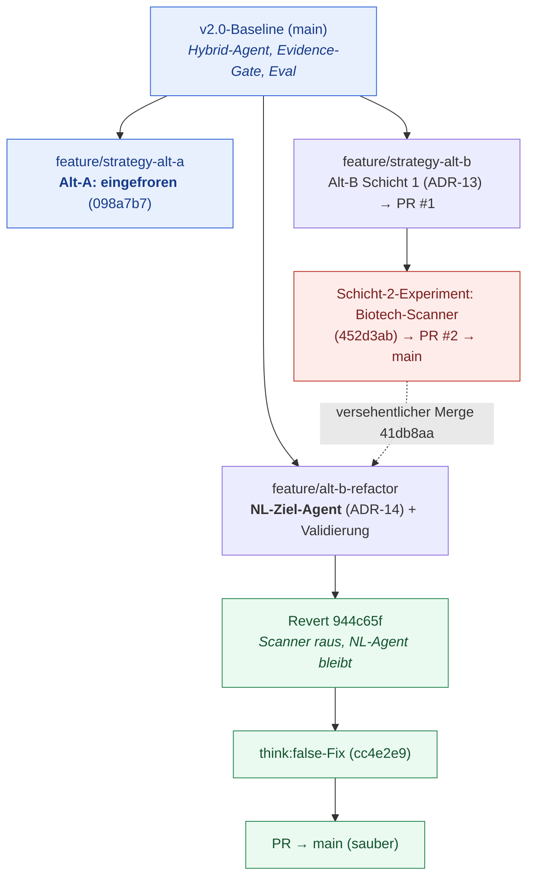

# 11. Projekt-Journey: Wie wir gearbeitet haben (Prozess & Entscheidungen)

> Diese Datei erzählt das **Wie** — den Ablauf, die Team-Aufteilung und die Entscheidungen zwischen den
> beiden Alternativen. Das **Was/Warum** der Technik steht in [refactor_architecture.md](refactor_architecture.md),
> die Entscheidungen formal im [Entscheidungslog (ADRs)](07-entscheidungslog.md), die Diagramme in
> [refactor_flowcharts.md](refactor_flowcharts.md).
>
> **Quellenlage:** Die Cross-Team-Punkte sind aus **Git-Historie + ADRs rekonstruiert**. Namens-/
> Team-Zuordnungen bitte **gegenprüfen** (besonders die Alt-A-Seite).

## Beteiligte (aus Git rekonstruiert — zu bestätigen)
- **Luca Fritzsching** — Architektur, Alt-B (NL-Ziel-Agent / Refactor).
- **Le Anh Minh Bui** — Baseline-Analysefixes, Alt-B-Mitarbeit (u. a. Schicht-2-Experiment).
- **NgogaSandro** — Stabilisierung der v2.0-Baseline (Evidence-Gate, Eval, Views).

Zwei Zweier-Stränge auf **einer** Codebasis: **Alt-A** (deterministisches DS-Ziel) und **Alt-B**
(NL-Freitext-Ziel). Gemeinsame Basis, **genau ein** bewusst variierter Unterschied (der Ziel-Typ).

## Gemeinsames Fundament (ADR-01 … ADR-12)
Bevor sich die Wege trennten, wurde gemeinsam entschieden:
- **Stack & Architektur** (ADR-01–03): Full-Stack-Neubau Vue 3 + FastAPI + PostgreSQL + Ollama.
- **Hybrid-Agent** (ADR-07): *die Entscheidung ist deterministisch, das LLM erklärt sie nur* — das
  gemeinsame Leitprinzip beider Alternativen.
- **Anti-Halluzination** (ADR-11): Evidence-Katalog + Faithfulness-Gate (`{{ev:id}}`-Platzhalter).
- **Streaming & I/O** (ADR-04, ADR-08): SSE über GET, eine geteilte Datenquelle (`market_data.py`).
- **Branching** (ADR-12): `main` (stabil) + `feature/strategy-alt-a` / `feature/strategy-alt-b`.

## Die Verzweigung der zwei Alternativen
- **Alt-A** blieb bei der **v2.0-Baseline** stehen (eingefroren, Commit `098a7b7`): das deterministische
  Ensemble (`compute_ensemble`) als Entscheider, LLM als Erklärer, Evidence-Gate. *Bewusst reproduzierbar.*
- **Alt-B** ist der **aktive Strang** und vollzog den Schwenk zum **NL-Ziel** (ADR-13 → ADR-14): von einer
  ersten regex-basierten Turnaround-Logik (Schicht 1) hin zum **konfigurierbaren Freitext-Kriterium**, das
  ein lokales LLM beurteilt — eingehegt durch einen Clamp (Regex ±1) und einen Decision-Trace.

## Der Alt-B-Weg im Detail (mit dem Zwischenfall)
1. **Schicht 1 (ADR-13):** deterministische Ereignis-Stärke (Regex, 0–5), Setup-Gate, Pre-Revenue-Fallback.
2. **Refactor zum NL-Ziel-Agent (ADR-14):** reiner Kern (`alt_b_signal.py`), Decision-Trace (`trace.py`),
   `nl_target.py` (Regex-Prefilter → `fast`/`agentic` LLM-Urteil → Clamp → Fallback → Cache), SSE-Endpoint
   `GET /api/agent/nl-target`, eigene **„Alt B"-UI** (`AltBView.vue`).
3. **Validierung:** 36-Läufe-Harness gegen echtes Qwen3:14b (`docs/evidence/`), Fehleranalyse, Reports.
4. **Der Zwischenfall:** ein versehentlicher Merge (`41db8aa`) zog einen **hartcodierten Biotech-Scanner**
   (Schicht-2-Experiment) in den Branch — eine Richtung, die **nicht** das Projektziel war.
5. **Die Korrektur:** sauberer **Revert** (`944c65f`) — Scanner raus, NL-Agent + Validierungs-Docs bleiben.
   Wichtig: der *letzte* Commit des Kollegen (`3eeef3a`) hatte gerade die NL-Agent-Arbeit in `main` gemergt
   und wurde **nicht** angefasst.
6. **Tuning-Fix:** `think:false` im fast-Pfad nachgezogen (`cc4e2e9`) — der per Eval diagnostizierte
   Geschwindigkeits-/Qualitäts-Defekt.

## Prozess-Flowchart (Zwei-Team-Branching + Zwischenfall)

## Zeitleiste (aus Git; Daten teils ungefähr)
| Datum | Meilenstein |
|---|---|
| ~2026-05-30 | Architektur v1 |
| 2026-06-01 | Architektur v2, erste Docs, Analyse-Fixes |
| 2026-06-09 | **v2.0-Baseline** stabilisiert (Evidence-Gate, Eval, Views) → **Alt-A eingefroren** |
| 2026-06-09/10 | Alt-B **Schicht 1** (Ereignis-Stärke, ADR-13) → PR #1 |
| 2026-06-10 | Schicht-2-Experiment (Biotech-Scanner) → PR #2 nach `main` |
| 2026-06-10/11 | Alt-B **Refactor**: pure core, Trace, `nl_target` (fast/agentic), Endpoint, UI, ADR-14 |
| 2026-06-11 | NL-Validierung (Harness + Reports) |
| (danach) | versehentlicher Scanner-Merge `41db8aa`; PR #4 mergt NL-Agent nach `main` |
| 2026-06-15 | **Revert** `944c65f` (Scanner raus); `think:false`-Fix `cc4e2e9` |

## Gelernt (Lessons Learned)
- **Ein bewusst variierter Faktor** macht den Vergleich erst sauber: gleiche Basis, nur der Ziel-Typ ändert sich.
- **Branch-Disziplin schützt `main`:** der versehentliche Merge zeigte, wie schnell Scope „verrutscht"; der
  Revert (statt History-Rewrite) hielt `main` sauber und die fremde Arbeit erhalten.
- **Eval findet konkrete Bugs:** das fehlende `think:false` war keine Vermutung, sondern ein gemessener Befund.
- **Determinismus als Rückgrat, LLM eingehegt:** dasselbe Prinzip trägt beide Alternativen — bei Alt-A im
  Evidence-Gate, bei Alt-B im Clamp.
