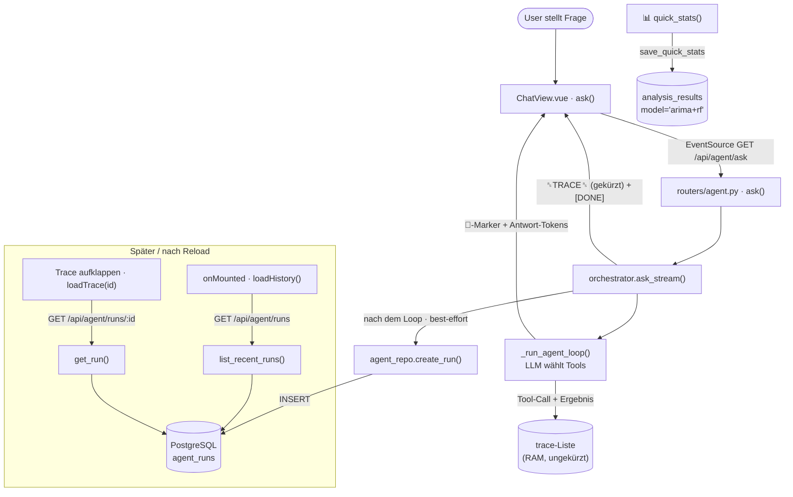
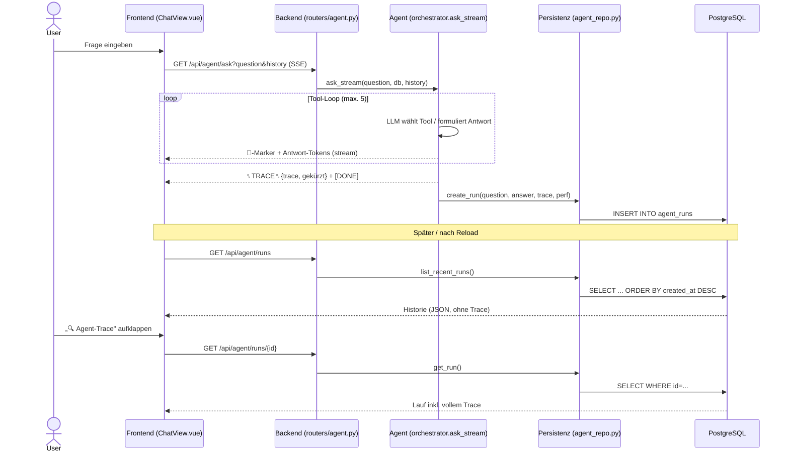

# 13 – Persistenz & Nachvollziehbarkeit des Agenten

> Stand: dokumentiert den aktuellen Projektstand. Beschreibt, **warum** wir Persistenz
> eingeführt haben, **wie** sie technisch funktioniert, **was sich geändert** hat und
> **welchen Mehrwert** sie für den Agenten bringt.

## 0. Warum Persistenz?

Vorher war der **Live-Agent zustandslos**: `/api/agent/ask` streamte die Antwort und
**vergaß danach alles**. Frage, Antwort, Tool-Aufrufe und deren Ergebnisse existierten nur
im Browser-RAM. Nach einem Reload war der Verlauf weg; nur der **letzte** Trace war sichtbar.
→ keine Chat-Historie, kein Audit-Trail, keine Reproduzierbarkeit.

Ziel: **Jeder Agent-Lauf wird dauerhaft in PostgreSQL gespeichert** (Frage, finale Antwort,
vollständiger Tool-Trace, Performance-Kennzahlen) und ist über neue API-Endpunkte abrufbar —
mit minimalen Eingriffen (**genau eine** neue Tabelle).

## 1. Architektur

- **Was wird gespeichert?**
  - Agent-Läufe (`/ask`) → Tabelle **`agent_runs`**: `question`, `answer`, `model`,
    `trace` (Tool-Aufrufe + ungekürzte Ergebnisse als JSON), `status`,
    `total_ms`, `eval_tokens`, `tokens_per_sec`, `created_at`.
  - Quick-Stats (📊, `/quick-stats`) → **wiederverwendete** Tabelle **`analysis_results`**
    mit `model="arima+rf"`.
- **Wann?** Beim Agent-Lauf **nach** dem Streaming (best-effort, Ende von `ask_stream`);
  bei Quick-Stats direkt nach der Berechnung.
- **Wo?** PostgreSQL (`portfaio-postgres`); Tabellen via `Base.metadata.create_all`
  in `database.py:init_db()` automatisch angelegt.
- **Wann geladen?** Frontend lädt die Historie **beim Mount** (`onMounted → loadHistory`
  → `GET /api/agent/runs`); voller Trace **on demand** beim Aufklappen
  (`loadTrace` → `GET /api/agent/runs/{id}`).
- **Wie nutzt der Agent das später?** **Indirekt** — der Agent fragt die DB *nicht* selbst ab.
  Das Frontend lädt die Historie nach einem Reload und schickt die letzten ~3 Turns als
  `history`-Parameter beim nächsten `/ask` mit (`buildHistory()`), die `ask_stream` als
  vorherige Nachrichten in den Prompt einfügt. → **Konversationsspeicher überleben Reloads.**

### Ablaufdiagramm

## 2. Code-Analyse (echte Dateien)

### Backend

| Datei | Aufgabe | Wichtigste Funktionen | Schreibt | Liest |
|---|---|---|---|---|
| `backend/models.py` | ORM-Modell **`AgentRun`** (neue Tabelle) | Spalten u. a. `trace` (JSON) | — | — |
| `backend/repositories/agent_repo.py` | Persistenzschicht (kapselt das gesamte SQL) | `create_run`, `list_recent_runs`, `get_run`, `save_quick_stats` | `agent_runs`, `analysis_results` | `agent_runs` |
| `backend/agent/orchestrator.py` | Agent-Loop + Persistenz im Live-Pfad | `ask_stream`, `_perf_from_stats`, `_run_agent_loop` | ruft `create_run` | — |
| `backend/routers/agent.py` | HTTP-Endpunkte | `ask`, `quick_stats`, **`list_runs`**, **`get_run_detail`** | via `ask_stream`/`save_quick_stats` | via Repository |
| `backend/schemas.py` | Response-Schemas | `AgentRunSummaryOut`, `AgentRunOut` | — | — |
| `backend/database.py` | Engine/Session, `init_db()` `create_all` | — | legt Tabelle an | — |

Details:
- **`AgentRun`**: Der freitextbasierte Router-Agent passt **nicht** in die ticker-/
  entscheidungszentrierten Tabellen `AnalysisResult`/`AnalysisMetric` (`ticker`/`signal`/
  `score` `NOT NULL`) → eigene Tabelle. Trace als **eine JSON-Spalte** (bewusst einfach).
- **`ask_stream`**: akkumuliert die finale Antwort (ohne `> 🔧`-Marker), sendet das
  **gekürzte** `␞TRACE␞`-Event nur fürs Frontend, ruft danach `create_run(...)` auf —
  **best-effort** (`try/except` + Log; ein Persistenzfehler bricht den Stream nie ab).
  `_run_agent_loop` hält die Tool-Ergebnisse im `trace` jetzt **ungekürzt**.
- **`save_quick_stats`**: schreibt `analysis_results` mit `model="arima+rf"` und einem
  JSON-Summary aus ARIMA+RandomForest.
- **Lese-Endpunkte** (neu, rein lesend): `GET /api/agent/runs?limit=` (Liste, ohne Trace),
  `GET /api/agent/runs/{id}` (mit Trace; 404 wenn nicht vorhanden).

### Frontend

| Datei | Aufgabe |
|---|---|
| `frontend/src/types/index.ts` | neue Typen `AgentTraceStep`, `AgentRunSummary`, `AgentRun` |
| `frontend/src/api/client.ts` | neue Methoden `api.agent.runs(limit)`, `api.agent.run(id)` |
| `frontend/src/views/ChatView.vue` | `loadHistory()` (im `onMounted`), `loadTrace(id)` (lazy), Trace-Anzeige je Verlaufseintrag; `exportLog()` = **clientseitiger** `.txt`-Download (kein DB-Zugriff) |

### Tests
- `backend/tests/test_persistence.py` — Repository-Round-Trip (inkl. **ungekürztem** Trace),
  `save_quick_stats`, `ask_stream`-Persistenz (Ollama gemockt).
- `backend/tests/test_api_integration.py` — nach `/ask` liefert `GET /api/agent/runs` den Lauf.
- Gesamt **111 Tests grün** (Python-3.12-Container).

## 3. Vorher vs. Jetzt

| Vorher | Jetzt |
|---|---|
| Keine Persistenz im Agent-Pfad | Jeder `/ask`-Lauf in `agent_runs` (PostgreSQL) |
| LLM-„Memory" nur im RAM, weg bei Reload | Historie wird beim Mount aus der DB geladen → Memory überlebt Reload |
| Keine Chat-Historie | `GET /api/agent/runs` (neueste zuerst) |
| Keine Tool-History | Tool-Aufrufe + Argumente + Ergebnisse als JSON-`trace` |
| Trace nur im Browser, auf 2500 Zeichen gekürzt, nur der letzte | DB speichert den **ungekürzten** Trace **jedes** Laufs; Kürzung nur im SSE-Event |
| Keine Performance-Daten des Live-Pfads | `total_ms`, `eval_tokens`, `tokens_per_sec` je Lauf |
| Quick-Stats (📊) flüchtig | nach Berechnung in `analysis_results` gespeichert (`model="arima+rf"`) |
| News-Judgement/Rankings/Scores/Evidence flüchtig | im persistierten `trace`-JSON enthalten |

**Bewusst NICHT vorhanden** (nicht erfunden):
- Keine Konversations-/Thread-Gruppierung (keine `agent_conversations`-Tabelle).
- Der Agent liest die DB nicht selbst zur Prompt-Bildung (Memory via `history`-Parameter).
- `/eval/metrics` liest weiterhin nur `analysis_metrics` (Legacy-/Eval-Pfad), nicht `agent_runs`.
- Der `.txt`-Export ist ein lokaler Download, keine DB-Persistenz.
- LLM-Sentiment wird nicht in `news_cache` zurückgeschrieben.

## 4. Frontend — wo die Persistenz sichtbar wird

Seite **KI-Agent** (`ChatView.vue`):
- **„Verlauf"**: nach Reload aus `GET /api/agent/runs` geladen (überlebt Reload).
- **„🔍 Agent-Trace"** je Verlaufseintrag: lädt den vollen Trace via `GET /api/agent/runs/{id}`.
- Live-Lauf: inline `> 🔧 Führe Tool aus: …` + Aufklapper „🔍 Agent-Trace (N Tool-Aufrufe …)".
- **„⬇ Log (.txt) exportieren"**: clientseitiger Download (kein DB-Persist).

Seite **Positionen** (`PositionsView.vue`):
- **📊 Statistik** → ARIMA/RandomForest; zusätzlich in `analysis_results` gespeichert.
  Die PositionsView lädt gespeicherte Quick-Stats aber nicht als alten UI-Zustand zurück.

Roh-Beweis (ohne UI): `GET http://localhost:8000/api/agent/runs` und
`…/api/agent/runs/{id}` liefern die gespeicherten Läufe als JSON.

## 5. Technischer Ablauf (Sequenzdiagramm)

## 6. Erklärung für die Präsentation (2–3 Min)

Unser KI-Agent beantwortet Freitext-Fragen zum Portfolio und wählt selbst das passende
Werkzeug (Strategie-Screen, beleggebundenes News-Urteil, statistische Modelle). **Problem
vorher:** der Agent war vergesslich — nach dem Streaming war alles weg: Frage, Antwort und vor
allem *welche Tools mit welchen Daten* zur Antwort führten. Nach einem Reload war der Verlauf
gelöscht, und man konnte nie belegen, wie der Agent zu einer Aussage kam.

**Deshalb Persistenz.** Jeder Lauf wird jetzt dauerhaft in PostgreSQL gespeichert: Frage,
finale Antwort und der **vollständige Tool-Trace** — jeder Werkzeugaufruf mit Argumenten und
ungekürztem Ergebnis, inkl. zitierter News-Belege und Scores, dazu Performance-Kennzahlen.

**Technisch** minimalinvasiv: **eine** neue Tabelle `agent_runs`, der Trace als ein JSON-Feld,
das gesamte SQL in einer Repository-Schicht gekapselt. Geschrieben wird am Ende des Streamings
*best-effort* (Speicherfehler brechen die Antwort nie ab). Zwei neue, rein lesende Endpunkte
geben Historie und Detail-Trace zurück.

**Im Frontend** sieht der Nutzer das direkt: Der „Verlauf" wird beim Öffnen aus der DB geladen
und überlebt Reloads; zu jedem früheren Lauf lässt sich der „Agent-Trace" aufklappen.

**Mehrwert:** (1) **Gedächtnis** — Folgefragen funktionieren über Reloads hinweg;
(2) **Nachvollziehbarkeit** — lückenloser Audit-Trail, bei Finanz-Aussagen entscheidend;
(3) **Auswertbarkeit** — gespeicherte Performance-/Trace-Daten erlauben Qualitätsmessung über
die Zeit. Aus einem vergesslichen Chat-Fenster wird ein nachvollziehbares, auswertbares System.
