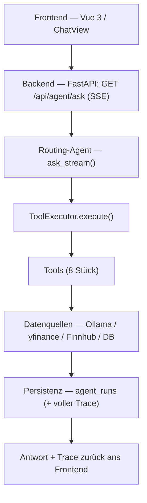
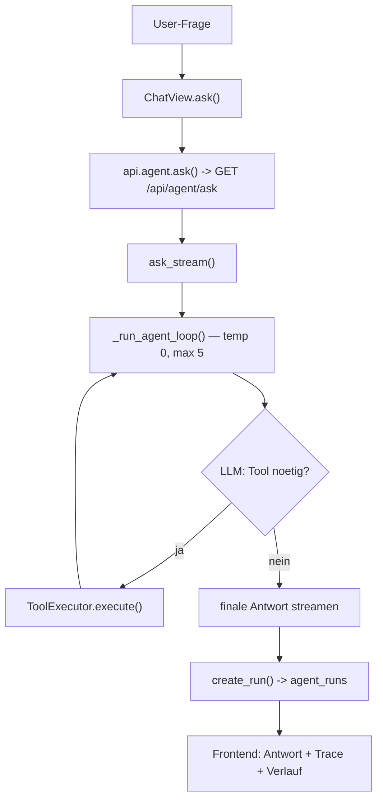
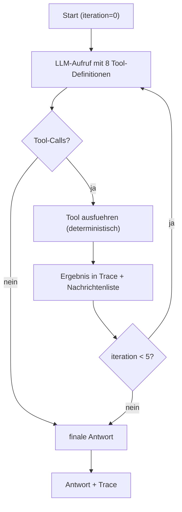
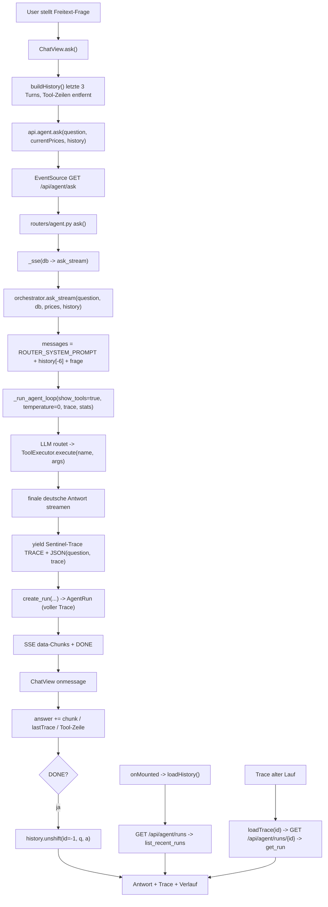
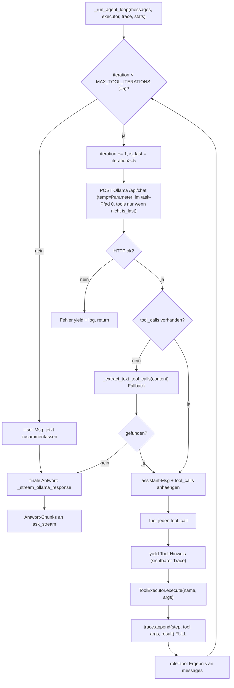

# Technische Gesamtübersicht (Präsentation + Referenz)

> Aus dem **aktuellen Code von `feature/news-discovery`** abgeleitet (vollständige Re-Analyse).
> **Aufbau:** **Teil 1 = Präsentation** (eine Aussage pro Folie, vereinfacht) · **Teil 2 = Anhang**
> (technische Referenz mit Detail-Flowcharts und vollständigen Tabellen).
>
> Kennzeichnung: **[FOLIE]** = direkt auf eine PowerPoint-Folie · **[ANHANG]** = Nachschlagewerk.

---
---

# TEIL 1 — PRÄSENTATION (Folien)

## Folie 1 — Architektur auf einen Blick **[FOLIE]**

**Merksatz:** Frontend → Backend → Routing-Agent → ToolExecutor → Tools → Datenquellen → Persistenz → Antwort.

---

## Folie 2 — Der Routing-Agent (Hauptablauf) **[FOLIE]**

Eine Freitext-Frage genügt — das LLM **routet selbst** zum richtigen Werkzeug.

---

## Folie 3 — Tool-Loop (wie der Agent arbeitet) **[FOLIE]**

---

## Folie 4 — KI-Entscheidung vs. deterministische Logik **[FOLIE]**

> Die zentrale Aussage der Präsentation: **Das LLM berechnet keine Finanzkennzahlen — es wählt Werkzeuge, parst Mandate, beurteilt News und formuliert.**

| 🤖 **Die KI entscheidet** | ⚙️ **Deterministisch (kein LLM)** |
|---|---|
| **welches Tool** benutzt wird | **ARIMA**-Prognose |
| die **Reihenfolge** der Tools | **Random Forest**-Signal |
| **News-Interpretation** (judge_news) | **technische Indikatoren** (RSI/MACD/…) |
| **Mandat-Parsing** (parse_mandate) | **Portfolio-Kennzahlen** (P&L, Gewicht) |
| die **finale Antwort** (Formulierung) | **Persistenz** (agent_runs) |
| | **Datenbank** (PostgreSQL) |
| | **API** (FastAPI-Routing) |
| | **Tool-Dispatch** (ToolExecutor) |

**Anti-Halluzination:** `judge_news` akzeptiert ein positives Urteil nur mit echten, aus der
Headline-Liste zitierten Belegen und Signifikanz >= 3; Screen-Zahlen werden gegen echte
yfinance-Werte gegengeprüft.

---

## Folie 5 — Tools kompakt (passt auf eine Folie) **[FOLIE]**

| Tool | Eingabe | Ausgabe | KI entscheidet Nutzung? |
|---|---|---|---|
| `screen_by_strategy` | Mandat (Freitext) | rangierte Kandidatenliste (Ticker, MktCap, Wachstum) | **ja** |
| `judge_news` | Ticker, Kriterium (Freitext) | Urteil (matches, Signifikanz 0–5, Belege, Trace) | **ja** |
| `run_statistical_model` | Ticker | ARIMA + RandomForest + Konsens-Signal | **ja** |
| `calculate_technical_indicators` | Ticker, Zeitraum | RSI/MACD/Bollinger/SMA + Trend | **ja** |
| `get_fundamentals` | Ticker | KGV, MktCap, EPS, 52W, Beta | **ja** |
| `get_news` | Ticker, Tage | News + Sentiment (firmen-gefiltert) | **ja** |
| `get_historical_prices` | Ticker, Zeitraum | OHLCV-Zusammenfassung | **ja** |
| `get_portfolio_context` | Ticker | Stück, Ø-Kaufpreis, P&L, Gewicht | **ja** |

**Aussage:** Bei **allen** Tools entscheidet die KI über die Nutzung. Die Finanz-/Portfolio-
Berechnungen laufen deterministisch; `screen_by_strategy` nutzt das LLM fürs Mandat-Parsing und
`judge_news` fürs beleggebundene News-Urteil.

---

## Folie 6 — Wichtigste Funktionen (Signatur + Parameter) **[FOLIE]**

### `ask_stream(question, db, current_prices=None, history=None)`
- **question** `str` — die Freitext-Frage des Nutzers
- **db** `AsyncSession` — DB-Sitzung (lebt für den ganzen Stream)
- **current_prices** `dict[str,float]` — Live-Kurse aus dem Frontend (für Portfolio-Tools)
- **history** `list[dict]` — vorherige Turns `{role, content}` (Gesprächsgedächtnis; nur letzte ~3)
- **Rückgabe:** `AsyncGenerator[str]` (SSE-Chunks)
- **Aufgabe:** Steuert den **kompletten Routing-Agenten**: Prompt + History bauen → Tool-Loop → Trace senden → Lauf persistieren.

### `_run_agent_loop(messages, executor, stats=None, show_tools=True, stream_final=True, temperature=0.3, trace=None)`
- **messages** `list[dict]` — laufende Chat-Nachrichten (System/User/Assistant/Tool)
- **executor** `ToolExecutor` — führt die Tool-Aufrufe aus
- **stats** `dict` — wird mit Ollama-Timing befüllt (Perf)
- **show_tools** `bool` — sichtbare „🔧"-Tool-Zeilen in den Stream schreiben?
- **stream_final** `bool` — finale Antwort token-streamen vs. als Block
- **temperature** `float` — Sampling (im `/ask`-Pfad **0** = reproduzierbar)
- **trace** `list` — sammelt je Tool-Call `{step, tool, args, result}` (für Persistenz/UI)
- **Rückgabe:** `AsyncGenerator[str]`
- **Aufgabe:** Die **Tool-Use-Schleife** (max. 5 Iterationen): LLM rufen, Tool-Calls ausführen, Ergebnisse zurückgeben, bis eine finale Antwort kommt.

### `ToolExecutor.execute(tool_name, arguments)`
- **tool_name** `str` — Name des vom LLM gewählten Tools
- **arguments** `dict` — vom LLM gelieferte Argumente
- **Rückgabe:** `str` (JSON) — Tool-Ergebnis **oder** `{"error": …}`
- **Aufgabe:** **Dispatcht** auf den passenden Handler, loggt + misst die Laufzeit, fängt Fehler ab.

### `screen_by_strategy(mandate)` *(Tool-Handler `_screen_by_strategy`)*
- **mandate** `str` — Anlagestrategie in Klarsprache (z. B. „Nasdaq-Biotech < 15 Mrd. mit Turnaround")
- **Rückgabe:** `str` (JSON) — geprüfte, rangierte Kandidaten + verwendete Filter
- **Aufgabe:** Mandat → `parse_mandate` (**LLM**) → `run_screen` (deterministisch) → Re-Filter auf echten MktCap/Umsatz → Top-Kandidaten.

### `judge_news(ticker, criterion)` *(Tool-Handler `_judge_news`)*
- **ticker** `str` — Aktien-Symbol
- **criterion** `str` — Freitext-Kriterium (z. B. „hat aktuell eine Turnaround-Story")
- **Rückgabe:** `str` (JSON) — `matches`, Signifikanz 0–5, Begründung, Belege, Grounding-Trace
- **Aufgabe:** Aktuelle Schlagzeilen firmen-gefiltert gegen das Kriterium beurteilen — **beleggebunden**; positives Urteil nur mit echter zitierter Headline und Signifikanz >= 3.

### `compute_ensemble(prices, fundamentals=None, news_sentiment=None, portfolio_ctx=None)`
- **prices** `list[dict]` — OHLCV-Zeitreihe
- **fundamentals** `dict` — KGV, Umsatzwachstum, … (optional)
- **news_sentiment** `float` — aggregiertes Sentiment [-1..1] (optional)
- **portfolio_ctx** `dict` — Positionskontext (P&L %, …) für Portfolio-Regeln (optional)
- **Rückgabe:** `EnsembleDecision` (signal, score, confidence, components, rationale)
- **Aufgabe:** **Deterministisches** gewichtetes Ensemble (Technik 0,30 · ARIMA 0,20 · RF 0,25 · Fundamentals 0,10 · News 0,15) → BUY/HOLD/SELL. **Reine Funktion** — gleiche Eingabe ⇒ gleiches Ergebnis.

### `create_run(db, *, question, answer, model, trace, status="ok", total_ms=None, eval_tokens=None, tokens_per_sec=None)`
- **db** `AsyncSession` — DB-Sitzung
- **question / answer** `str` — Frage und finale Antwort
- **model** `str` — verwendetes LLM (z. B. `qwen3:14b`)
- **trace** `list[dict]` — **vollständiger, ungekürzter** Tool-Trace
- **status** `str` — `ok | error`
- **total_ms / eval_tokens / tokens_per_sec** — Performance (best-effort aus Ollama-Timing)
- **Rückgabe:** `AgentRun` (persistierte Zeile)
- **Aufgabe:** Speichert **einen** `/ask`-Lauf als Chat-History **und** Audit-Trail in `agent_runs`.

---

## Folie 7 — Persistenz & Nachvollziehbarkeit **[FOLIE]**

- **Jeder `/ask`-Lauf** → Tabelle `agent_runs` (Frage, Antwort, **voller Tool-Trace**, Modell, Perf) via `create_run`.
- **Verlauf übersteht Reload:** `ChatView.loadHistory()` → `GET /api/agent/runs` → `list_recent_runs`.
- **Nachvollziehbar:** alter Lauf → Trace **lazy** via `GET /api/agent/runs/{id}` → `get_run`; aktueller Lauf zusätzlich als **`.txt`-Export** (`exportLog`).
- **Live-Trace:** während des Streams als Sentinel-Event (`␞TRACE␞`), in der UI aufklappbar.

---

## 2-Minuten-Erklärung für den Professor **[FOLIE / Sprechzettel]**

1. **Architektur:** Vue-SPA → FastAPI (SSE) → PostgreSQL; lokales Ollama-LLM, yfinance/Finnhub als Daten. Seit ADR-16/17 **ein** routender Chat-Agent statt vieler Spezial-Views.
2. **Tool-Loop:** `ChatView.ask()` → `GET /api/agent/ask` → `ask_stream` → `_run_agent_loop` (max. 5 Iter., temp 0). Das LLM bekommt **8 Tools** und entscheidet selbst, welches es mit welchen Argumenten ruft; `ToolExecutor.execute` führt aus, Ergebnis geht zurück — bis die finale Antwort kommt.
3. **KI vs. deterministisch:** KI = Tool-Routing, Reihenfolge, Mandat-Parsing, News-Urteil, Sprache. Deterministisch = ARIMA, Random Forest, Indikatoren, Portfolio-Kennzahlen, Persistenz, DB, API und Tool-Dispatch; Anti-Halluzination bei News über echte zitierte Headlines + Signifikanzschwelle.
4. **Persistenz/Trace:** Jeder Lauf wird mit vollem Trace in `agent_runs` gespeichert; der Verlauf wird über `/api/agent/runs` zurückgeholt → **übersteht den Reload**. Der aktuelle Lauf ist zusätzlich als `.txt` exportierbar.

---
---

# TEIL 2 — ANHANG (technische Referenz)

## A1. Code-Bestandsaufnahme — relevante Dateien **[ANHANG]**

**Backend – App/Infra:** `main.py` (FastAPI, CORS, Router, `init_db`+`seed_demo_positions`),
`database.py` (`AsyncSessionLocal`, `init_db`=`create_all`), `models.py` (10 Tabellen), `schemas.py`, `utils.py`.

**Backend – Router:** `routers/portfolio.py` (CRUD + `/import`), `routers/quotes.py` (Finnhub-Proxy),
`routers/market_data.py` (Historie/Fundamentals/News/`warmup`), `routers/agent.py` (unter
`/api/agent`: `/ask`, `/runs`, `/quick-stats`, Legacy-Streams, `/status`), `routers/eval.py`
(Metriken + Backtest).

**Backend – Agent/LLM:** `agent/orchestrator.py` (`ask_stream`, `_run_agent_loop`), `agent/tools.py`
(`TOOL_DEFINITIONS`, `ToolExecutor`), `agent/prompts.py` (`ROUTER_SYSTEM_PROMPT`), `agent/data_science.py`
(Indikatoren/ARIMA/RF/`compute_ensemble`), `agent/pipeline.py` + `agent/evidence.py` + `eval/faithfulness.py`
(Legacy-Alt-A, im Code, nicht UI-verdrahtet), `agent/sentiment.py`.

**Backend – Services:** `services/finder.py` (`parse_mandate`, `run_screen`, …), `services/nl_target.py`
(`evaluate_nl_target`, `build_verdict`), `services/event_strength.py` (`classify_event`, `is_relevant`),
`services/market_data.py`, `repositories/agent_repo.py` (`create_run`, `list_recent_runs`, `get_run`, `save_quick_stats`).

**Frontend:** `views/ChatView.vue` (DIE Agent-View), `DashboardView/PositionsView/SavingsView/NewsView/EvalView`,
`stores/portfolio.ts` (+ `ui.ts`), `api/client.ts`.

> **Auf diesem Branch entfernt/ersetzt:** keine `AnalysisView/AltBView/ScreenerView`; **keine**
> `screener_*`-Tabellen — Strategie-Suche läuft live über `services/finder.py`.

---

## A2. Detail-Flowchart: Routing-Agent `/ask` end-to-end **[ANHANG]**

---

## A3. Detail-Flowchart: Tool-Loop (`_run_agent_loop`) **[ANHANG]**

---

## A4. Detail-Flowchart: die beiden zentralen Tools intern **[ANHANG]**

```mermaid
flowchart TD
  subgraph SCREEN["screen_by_strategy(mandate)"]
    M1["parse_mandate(mandate)  [KI: Ollama -> Filter-JSON, validiert]"] --> M2["run_screen(filters)  [DET: yfinance equity-query]"]
    M2 --> M3{Kandidaten?}
    M3 -- nein --> M4["load_fallback_universe()  [DET]"]
    M3 -- ja --> M5
    M4 --> M5["_enrich top-12 via yfinance (parallel)  [DET]"]
    M5 --> M6["Re-Filter MarketCap + Umsatzwachstum  [DET]"]
    M6 --> M7["sort nach MarketCap -> top 8  [DET]"]
  end
  subgraph JUDGE["judge_news(ticker, criterion)"]
    J1["fetch_and_store_news 14T  [DET/Finnhub]"] --> J2["is_relevant Filter auf Firma  [DET]"]
    J2 --> J3["prefilter: leere/fremde Headlines raus  [DET]"]
    J3 --> J4["LLM-Urteil matches/strength/evidence  [KI]"]
    J4 --> J5["build_verdict: echte Evidence-Indizes + strength >= 3  [DET-Guard]"]
    J5 --> J6["Verdict + Trace (llm_strength/final/evidence/source)"]
  end
```

---

## A5. Vollständige Funktions-/Parameter-Tabelle **[ANHANG]**

| Datei | Funktion / Klasse | Parameter | Rückgabe | Aufgabe | KI? |
|---|---|---|---|---|---|
| orchestrator.py | `ask_stream` | `question, db, current_prices=None, history=None` | `AsyncGenerator[str]` | Routing-Agent steuern | ja |
| orchestrator.py | `_run_agent_loop` | `messages, executor, stats=None, show_tools=True, stream_final=True, temperature=0.3, trace=None` | `AsyncGenerator[str]` | Tool-Schleife (max 5) | ja |
| orchestrator.py | `_perf_from_stats` | `stats` | `(total_ms, eval_tokens, tps)` | Ollama-Timing → Perf | nein |
| orchestrator.py | `analyze_stock_stream` | `ticker, db, current_prices, agentic=False` | `AsyncGenerator[str]` | Legacy-Alt-A (Ensemble + Evidence-Gate) | teils |
| tools.py | `ToolExecutor.execute` | `tool_name, arguments` | `str (JSON)` | Tool dispatchen/loggen/timen | nein |
| tools.py | `_screen_by_strategy` | `mandate` | `str (JSON)` | Strategie-Screen end-to-end | parse=KI |
| tools.py | `_judge_news` | `ticker, criterion` | `str (JSON)` | NL-Urteil aus News | LLM-Teil |
| agent_repo.py | `create_run` | `db, *, question, answer, model, trace, status="ok", total_ms, eval_tokens, tokens_per_sec` | `AgentRun` | Lauf persistieren | nein |
| agent_repo.py | `list_recent_runs` | `db, limit=50` | `list[AgentRun]` | Verlauf laden | nein |
| agent_repo.py | `get_run` | `db, run_id` | `AgentRun \| None` | Lauf + Trace laden | nein |
| agent_repo.py | `save_quick_stats` | `db, ticker, arima, ml` | `AnalysisResult` | Quick-Stats persistieren | nein |
| finder.py | `parse_mandate` | `mandate, *, parse_fn=None` | `ParsedMandate` | Freitext → Filter + nl_criterion | **ja (LLM)** |
| finder.py | `run_screen` | `filters, *, size, screen_fn=None` | `(list[ScreenCandidate], source)` | deterministischer Screen | nein |
| finder.py | `load_fallback_universe` | – | `list[ScreenCandidate]` | Fallback-Universum | nein |
| nl_target.py | `evaluate_nl_target` | `criterion, items, ticker="", name="", *, mode="fast", llm_fn, chat_fn, cache` | `NLVerdict` | prefilter→LLM→Grounding | teils |
| nl_target.py | `build_verdict` | `criterion, survivor_texts, llm_result, *, mode="fast"` | `NLVerdict` | echte Evidence-Indizes + Signifikanzschwelle prüfen | nein |
| event_strength.py | `classify_event` | `headline, summary="", source=None` | `EventClassification` | Ereignis-Klassifikation | nein |
| event_strength.py | `is_relevant` | `headline, summary, ticker, name=""` | `bool` | Firmenbezug | nein |
| data_science.py | `compute_ensemble` | `prices, fundamentals=None, news_sentiment=None, portfolio_ctx=None` | `EnsembleDecision` | gewichtetes Ensemble | nein |
| data_science.py | `run_arima_forecast` | `prices` | `ModelForecast` | ARIMA(2,1,2) 7/30T | nein |
| data_science.py | `run_ml_signal` | `prices` | `ModelForecast` | RandomForest (100, seed 42) | nein |
| data_science.py | `calculate_technical_indicators` | `prices` | `TechnicalIndicators` | RSI/MACD/Bollinger/SMA/EMA | nein |
| routers/portfolio.py | `add_transaction` | `ticker, body, db` | `TransactionOut` | Buy/Sell bucht + `shares` aktualisieren | nein |
| routers/portfolio.py | `execute_savings_plan` | `plan_id, current_price, db` | `SavingsPlanOut` | Sparplan → Position/Tx | nein |
| ChatView.vue | `ask` / `buildHistory` / `loadHistory` / `loadTrace` / `exportLog` | – | – | Frage / Memory / Verlauf / Trace / Export | – |

---

## A6. Vollständige Tool-Tabelle **[ANHANG]**

| Tool | Parameter | Was es tut | Output | Daten/Logik |
|---|---|---|---|---|
| `get_historical_prices` | `ticker, period="1y"` | OHLCV laden/cachen, 30T-Zusammenfassung | JSON | yfinance/DB, det. |
| `calculate_technical_indicators` | `ticker, period="1y"` | RSI/MACD/Bollinger/SMA/EMA + Trend | JSON | det. |
| `get_fundamentals` | `ticker` | KGV, MktCap, EPS, 52W, Beta, Sektor | JSON | yfinance, det. |
| `get_news` | `ticker, days=7` | News + Sentiment, `is_relevant`-Filter | JSON | Finnhub/DB, det. |
| `run_statistical_model` | `ticker` | ARIMA + RandomForest + Konsens | JSON | det. |
| `get_portfolio_context` | `ticker` | Stück, Ø-Kaufpreis, P&L, Gewicht | JSON | DB, det. |
| `screen_by_strategy` | `mandate` | Mandat→Filter→Screen→Re-Filter→Rang | JSON | `parse_mandate`=KI, Rest det. |
| `judge_news` | `ticker, criterion` | News gegen Kriterium, beleggebunden | JSON | LLM + Evidence-Grounding |

---

## A7. KI vs. deterministisch (vollständig) **[ANHANG]**

| Bereich | KI? | Det.? | Erklärung |
|---|---|---|---|
| Tool-Routing/-Auswahl + Reihenfolge | **ja** | nein | `tool_calls` aus dem LLM (`ROUTER_SYSTEM_PROMPT`, temp 0) |
| Finale Formulierung | **ja** | nein | LLM streamt deutsche Erklärung |
| Mandat-Parsing (`parse_mandate`) | **ja** | Validierung det. | NL→Filter-JSON; unbekannte Felder verworfen |
| News-Urteil (`judge_news`) | **teils** | **teils** | LLM bewertet; `build_verdict` verlangt echte zitierte Headlines und Signifikanz >= 3 |
| Strategie-Screen + Re-Filter + Rang | nein | **ja** | yfinance-Query, MktCap/Umsatz-Check, Sort |
| News-Relevanz/Ereignis | nein | **ja** | `is_relevant`, `classify_event` |
| ARIMA / RandomForest / Indikatoren / Ensemble | nein | **ja** | reine Funktionen (`(2,1,2)`, `random_state=42`, feste Gewichte/Schwellen) |
| Portfolio-Kennzahlen | nein | **ja** | Backend + Pinia-`computed` |
| Persistenz / Trace / History | nein | **ja** | SQLAlchemy, `agent_runs.trace` |
| API / Quotes / Tool-Dispatch | nein | **ja** | FastAPI, Finnhub, `ToolExecutor` |

---

## A8. API-Endpunkte (alle) **[ANHANG]**

| Methode | Pfad | Zweck |
|---|---|---|
| GET | `/api/agent/ask` | **Routing-Agent** (SSE) |
| GET | `/api/agent/runs` · `/api/agent/runs/{run_id}` | Verlauf · ein Lauf inkl. Trace |
| GET | `/api/agent/quick-stats/{ticker}` | ARIMA+RF ohne LLM (persistiert) |
| GET/POST | `/api/agent/status` · `/api/agent/pull-model` | Ollama-Status · Modell laden |
| GET | `/api/agent/analyze/{ticker}` · `/api/agent/analyze-portfolio` · `/api/agent/chat` · `/api/agent/news-summary/{ticker}` · `/api/agent/rebalance` | Legacy-SSE (nicht UI-Default) |
| GET/POST/PATCH/DELETE | `/api/portfolio/positions…` · `/api/portfolio/positions/{ticker}/transactions` · `/api/portfolio/savings-plans…/execute` · `/api/portfolio/import` | Portfolio-CRUD |
| GET | `/api/quotes/{ticker}` · `/api/quotes/batch/quotes` | Finnhub-Quotes |
| GET/POST | `/api/market-data/history/{ticker}` · `/api/market-data/fundamentals/{ticker}` · `/api/market-data/news/{ticker}` · `/api/market-data/warmup` | Marktdaten + Warmup |
| GET | `/api/eval/metrics` · `/api/eval/backtest` | Metriken + Backtest |

---

## A9. Datenmodell (PostgreSQL, 10 Tabellen) **[ANHANG]**

| Tabelle | Modell | Zweck |
|---|---|---|
| `positions` | Position | Ticker (unique), Name, shares, Sektor, manual_buy_price |
| `transactions` | Transaction | buy/sell, shares, price, date, realized_pnl |
| `savings_plans` / `savings_plan_executions` | SavingsPlan(/Execution) | Sparpläne + Ausführungen |
| `price_history` | PriceHistory | OHLCV, unique (ticker, date) |
| `fundamentals_cache` | FundamentalsCache | KGV, MktCap, EPS, 52W, Beta |
| `news_cache` | NewsCache | Headline, summary, source, published_at, sentiment |
| `analysis_results` | AnalysisResult | Analyse-Text **und** Quick-Stats (`model="arima+rf"`) |
| `analysis_metrics` | AnalysisMetric | Signal/Score/Latenz/Faithfulness (Legacy) |
| **`agent_runs`** | **AgentRun** | **`/ask`-Läufe: question, answer, model, trace(JSON), status, Perf, created_at** |

> `init_db()` macht nur `create_all` — Schemaänderung ⇒ betroffene Tabelle im Container droppen.
> Nicht mehr vorhanden: `screener_universe` / `screener_runs`.

---

## A10. Persistenz/Trace (vollständig) **[ANHANG]**

| Was | Tabelle | gespeichert von | wieder geladen | Frontend | Reload-fest? |
|---|---|---|---|---|---|
| Agent-Lauf + voller Trace | `agent_runs` | `create_run` | `list_recent_runs` / `get_run` | Verlauf + 🔍 Trace | **ja** |
| Quick-Stats (ARIMA+RF) | `analysis_results` | `save_quick_stats` | — | PositionsView-Button | DB ja / UI-Zustand nein |
| Legacy-Analyse + Metriken | `analysis_results`, `analysis_metrics` | `analyze_stock_stream` | `/eval/metrics` | EvalView | ja |
| Kurse/Fundamentals/News | `price_history`/`fundamentals_cache`/`news_cache` | `services/market_data` | Tools/Pipeline | indirekt | ja |
| Portfolio/Tx/Sparpläne | `positions`/`transactions`/`savings_plans` | `routers/portfolio.py` | Pinia-Store | überall | ja |
| Live-Tool-Trace (SSE) | — (Transport) | `ask_stream` Sentinel `␞TRACE␞` (gekürzt 2500) | `lastTrace` | aufklappbar + `.txt`-Export | nein (DB hat den vollen) |

---

## A11. Tests (relevant) **[ANHANG]**

`test_agent_routing.py` (Tool-Routing), `test_tools.py` (ToolExecutor), `test_finder.py`
(parse_mandate/run_screen/Re-Filter), `test_nl_target.py` (prefilter + Evidence-Grounding + Fallback),
`test_event_strength.py`, `test_data_science.py` (ARIMA/RF/Indikatoren), `test_persistence.py`
(agent_runs/AnalysisResult), `test_evidence_faithfulness.py`, `test_api_integration.py`,
`test_input_validation.py` (Eingabe-Bounds).

---

## Verifikation
- Alle Namen direkt aus dem Code von `feature/news-discovery` gelesen (Router, Orchestrator, Tools,
  finder/nl_target, agent_repo, models, ChatView, client.ts, stores, data_science).
- Mermaid: nur ASCII-Node-IDs, keine Emojis/Sonderzeichen in Node-IDs → renderbar.
