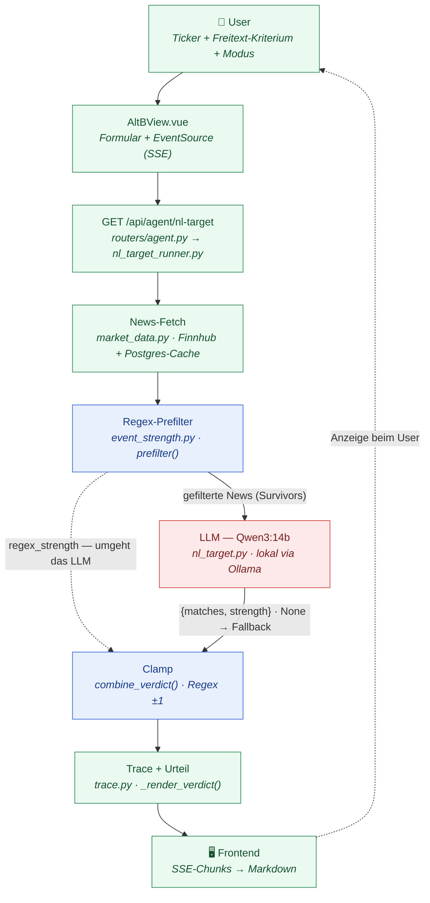
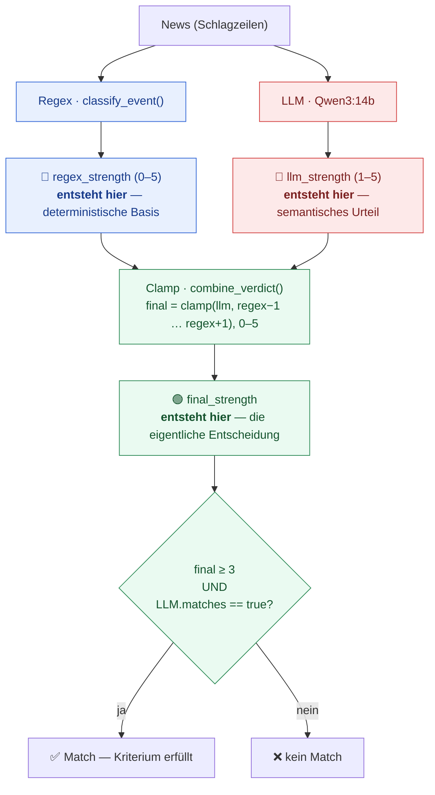
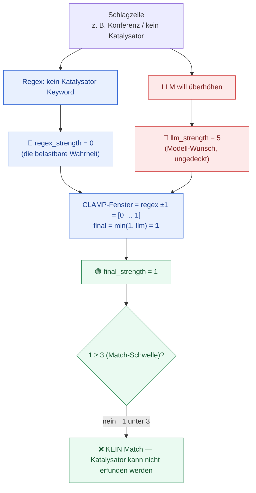
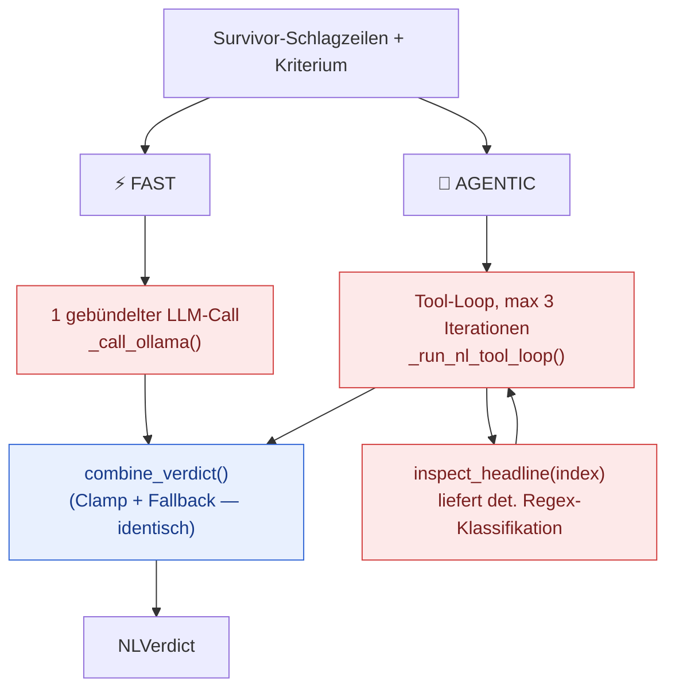
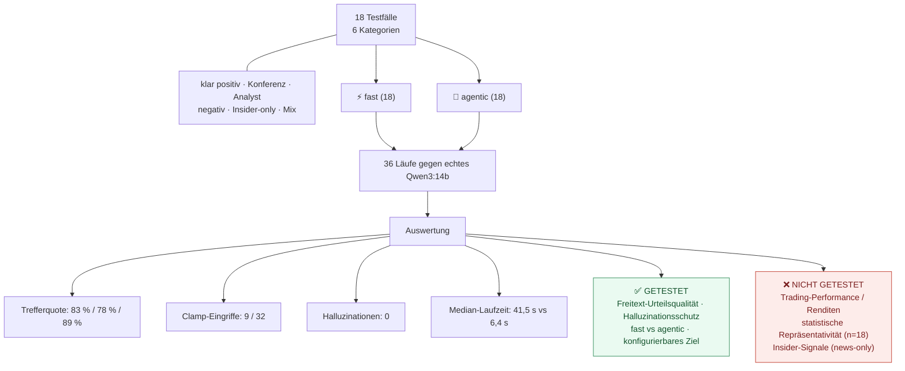

# Präsentations-Flowcharts — Alt-B Refactor (NL-Ziel-Agent)

> Präsentationsfertige Diagramme für die Verteidigung (Dienstag). Grundlage:
> [alt-b-funktionen-verteidigung.md](alt-b-funktionen-verteidigung.md). **Alle Zahlen** stammen aus
> [refactor_validation.md](refactor_validation.md) und sind per
> [`refactor_nl_verify.py`](evidence/refactor_nl_verify.py) gegen die Rohdaten geprüft (Exit 0).
>
> **Nutzung in PowerPoint:** Mermaid → [mermaid.live](https://mermaid.live) einfügen, als PNG/SVG
> exportieren, auf die Folie ziehen. ASCII-Version → in eine Textbox mit **Monospace-Schrift**
> (z. B. Consolas) einfügen, falls kein Bild gewünscht ist.

---

## Flowchart 1 — Gesamtarchitektur

**Ziel der Grafik:** Der Professor versteht den **kompletten Refactor in einem Bild** — vom Nutzer bis
zurück ins Frontend, mit Datei, Input, Output und Zweck pro Station.

### Mermaid



> Farblegende: 🔵 deterministisch (Regex, Clamp) · 🔴 LLM (nicht-deterministisch, eingehegt) · 🟢 I/O & Transport.

### ASCII

```
 👤 USER  ─  Ticker + Freitext-Kriterium + Modus (fast|agentic)
   │
   ▼
 [ AltBView.vue ]             Formular, öffnet EventSource (SSE)
   │
   ▼
 [ GET /api/agent/nl-target ] routers/agent.py → nl_target_runner
   │
   ▼
 [ News-Fetch ]               market_data.py · Finnhub, 14 T, Postgres
   │
   ▼
 [ Regex-Prefilter ]          event_strength.py · DETERMINISTISCH
   │  Survivor-News           regex_strength ─────────────┐
   ▼                                 (umgeht das LLM!)     │
 [ LLM  Qwen3:14b ]  nl_target.py · fast/agentic          │
   │  {matches, strength}   (None → Regex-Fallback)        │
   ▼                                                       ▼
 [ Clamp ] ◄──────────────────────────────────────────────┘
   combine_verdict():  final = clamp(llm, regex±1)
                       match  = llm.matches  UND  final ≥ 3
   │
   ▼
 [ Trace + Urteil ]           trace.py · _render_verdict()
   │
   ▼
 🖥️ FRONTEND                  SSE-Chunks → Markdown ──► zurück zum User
```

### Stationen im Detail

| Block | Datei | Input | Output | Zweck |
|---|---|---|---|---|
| **User** | — | — | Ticker, Kriterium, Modus | Die zwei freien Eingaben |
| **AltBView** | `views/AltBView.vue` | Formulareingaben | EventSource-Request | UI + SSE-Rendering |
| **Endpoint** | `routers/agent.py:98` | Query-Params | SSE-Stream | GET-SSE-Brücke (ADR-04) |
| **News-Fetch** | `market_data.py:147` | Ticker, 14 Tage | Schlagzeilen | Datenbeschaffung (eine Quelle, ein Cache) |
| **Regex-Prefilter** | `event_strength.py` / `prefilter()` | Schlagzeilen | Survivors + `regex_strength` | Deterministische Basis; droppt negativ/irrelevant |
| **LLM** | `nl_target.py` (`_call_ollama`/`_run_nl_tool_loop`) | Survivors + Kriterium | `{matches, strength, evidence, reason}` | Semantisches Freitext-Urteil |
| **Clamp** | `combine_verdict()` | `regex_strength` + LLM-JSON | `NLVerdict` (final, matches) | Anti-Halluzination |
| **Trace** | `trace.py` / `_render_verdict` | `NLVerdict` | Markdown (Urteil + Trace) | Nachvollziehbarkeit |
| **Frontend** | `views/AltBView.vue` | SSE-Chunks | Gerendertes Urteil | Anzeige beim User |

**Erklärung:** Die Kette ist bewusst **billig → teuer** sortiert: Erst der deterministische Regex-Filter
(verwirft Negatives/Irrelevantes umsonst), dann das lokale LLM nur auf den Überlebenden, ganz am Ende der
Clamp als Wächter. **Wichtig — der Regex-Schritt gabelt sich:** die gefilterten Schlagzeilen gehen ans LLM,
aber die deterministische `regex_strength` **umgeht das LLM** und fließt direkt in den Clamp (`combine_verdict`).
Das LLM wird zudem nur bedingt aufgerufen — bei *keinen* Survivors → `no_signal` ohne LLM-Call, bei LLM-Ausfall
→ `regex_fallback`. So bleibt das System MacBook-tauglich, und das LLM ist die einzige nicht-deterministische
Stelle — eingehegt durch eine Regex-Basis, die es nicht beeinflusst.

**Typische Professorenfrage:** *„Wo genau steckt in diesem Ablauf die künstliche Intelligenz?"*

**Musterantwort:** „Genau an einer Stelle — dem roten Block. Das lokale Qwen3:14b beurteilt semantisch, ob
die Schlagzeilen das frei formulierte Kriterium erfüllen. Alles davor (News holen, Regex-Filter) und alles
danach (Clamp, Trace) ist deterministischer Code. Dadurch ist die KI bewusst auf das beschränkt, was sie gut
kann — Textverständnis —, und der reproduzierbare Code behält die Kontrolle.“

---

## Flowchart 2 — Entscheidungslogik

**Ziel der Grafik:** Erklären können, **wo die Entscheidung tatsächlich getroffen wird** — und zeigen, dass
sie im deterministischen Code liegt, nicht im LLM. `Regex + LLM + Clamp = finales Urteil`.

### Mermaid



### ASCII

```
            News (Schlagzeilen)
             │                  │
             ▼                  ▼
   [ Regex classify_event ]   [ LLM Qwen3:14b ]
             │                  │
             ▼                  ▼
   🔵 regex_strength        🔴 llm_strength
      (0–5, deterministisch)   (1–5, Modell-Wunsch)
      ← ENTSTEHT HIER          ← ENTSTEHT HIER
             │                  │
             └────────┬─────────┘
                      ▼
        ┌──────────────────────────────────┐
        │  CLAMP  combine_verdict()         │
        │  final = clamp(llm, regex±1) 0..5 │
        └──────────────────────────────────┘
                      ▼
        🟢 final_strength   ← ENTSTEHT HIER (die Entscheidung)
                      ▼
            final ≥ 3  UND  LLM.matches?
               ┌──────────┴──────────┐
               ▼                     ▼
          ✅ MATCH               ❌ KEIN MATCH

   ─────────────────────────────────────────────
        REGEX  +  LLM  +  CLAMP  =  FINALES URTEIL
   ─────────────────────────────────────────────
```

**Erklärung:** Die Regex liefert eine deterministische Basis-Stärke, das LLM eine Roh-Stärke. Der Clamp
verschmilzt beide zur finalen Stärke — gebunden auf `Regex ± 1`. Die Entscheidung „Match ja/nein" fällt damit
**im Code** (Clamp + Schwelle 3), nicht im LLM; das boolesche `matches` des LLM bleibt zusätzlich als Veto bindend.

**Typische Professorenfrage:** *„Wer trifft am Ende die Entscheidung — euer Code oder das LLM?"*

**Musterantwort:** „Der Code. Das LLM liefert nur einen Vorschlag — Roh-Stärke plus ein Ja/Nein. Die finale
Stärke entsteht im Clamp, der den LLM-Wert auf die deterministische Regex-Basis ±1 begrenzt, und ein Match
verlangt zusätzlich Stärke ≥ 3. Das LLM kann also nach unten oder oben nuancieren, aber die deterministische
Grenze nie verlassen — deshalb ist jede Entscheidung reproduzierbar.“

---

## Flowchart 3 — Halluzinationsschutz

**Ziel der Grafik:** Die Frage *„Wie verhindert ihr Halluzinationen?"* grafisch beantworten — mit dem
Worst-Case-Beispiel `regex = 0, llm = 5 → final = 1` und den **echten** geblockten Versuchen aus der Validierung.

### Mermaid



### ASCII

```
  Schlagzeile (Konferenz, kein Katalysator)
         │                          │
         ▼                          ▼
  [ Regex: kein Keyword ]    [ LLM will überhöhen ]
         │                          │
         ▼                          ▼
  🔵 regex_strength = 0       🔴 llm_strength = 5
     (belastbare Wahrheit)       (ungedeckter Wunsch)
         └───────────┬──────────────┘
                     ▼
   ┌──────────────────────────────────────────┐
   │ CLAMP-Fenster = regex ±1 = [ 0 … 1 ]      │
   │ final = min(1, 5) = 1   ← gedeckelt!      │
   └──────────────────────────────────────────┘
                     ▼
            🟢 final_strength = 1
                     ▼
              1 ≥ 3 (Match-Schwelle)?  ──►  NEIN
                     ▼
   ❌ KEIN Match — der Katalysator kann nicht erfunden werden
```

**Erklärung:** Der Clamp deckelt die finale Stärke auf `regex + 1`. Hat eine Schlagzeile keine
Katalysator-Keywords (Regex-Basis 0), kann das LLM sie selbst mit Wunsch-Stärke 5 maximal auf 1 bringen — und
1 liegt unter der Match-Schwelle 3. Ein erfundener Katalysator ist damit strukturell ausgeschlossen.

**Echte Belege aus der Validierung** (geprüft, [refactor_validation.md](refactor_validation.md) §4):
- **3 reale Überhöhungsversuche** (Regex-Basis 0, LLM-Roh ≥ 3): Fälle **05-fast, 15-fast, 16-fast** — jeweils
  LLM-Roh **3 → final 1**, kein Match. **Alle 3 vom Clamp geblockt.**
- **0 Halluzinationen über 32 LLM-Läufe.** (Das `llm=5`-Bild oben ist der Worst-Case der Formel; die
  gemessenen Versuche lagen bei Roh-Stärke 3 — der Clamp greift in beiden Fällen identisch.)

**Typische Professorenfrage:** *„Wie verhindert ihr, dass das LLM einen Katalysator erfindet?"*

**Musterantwort:** „Durch eine harte Obergrenze im Code: Die finale Stärke wird auf die deterministische
Regex-Basis plus eins gedeckelt. Eine Schlagzeile ohne Katalysator-Keyword hat Basis 0, also maximal final 1 —
und ein Match braucht mindestens 3. In unseren 36 Läufen hat das LLM dreimal versucht, eine 0-Basis-Schlagzeile
hochzustufen; alle drei Male wurde es geklemmt. Ergebnis: null Halluzinationen über 32 LLM-Läufe.“

---

## Flowchart 4 — Fast vs. Agentic

**Ziel der Grafik:** Erklären können, **warum agentic besser war** — mit ausschließlich gemessenen Werten.

### Mermaid



### ASCII

```
        Survivor-Schlagzeilen + Kriterium
                 │                 │
                 ▼                 ▼
        ┌──────────────┐   ┌──────────────────────────────┐
        │ ⚡ FAST       │   │ 🔁 AGENTIC                    │
        │ 1 LLM-Call    │   │ Tool-Loop (max 3 Iter.)      │
        │ _call_ollama  │   │ ┌──────────────────────────┐ │
        │               │   │ │ inspect_headline(index)  │ │
        │               │   │ │ → det. Regex-Klassifik.  │ │
        │               │   │ └──────────┬───────────────┘ │
        │               │   │     wiederholen bis sicher   │
        └──────┬────────┘   └─────────────┬────────────────┘
               └──────────────┬───────────┘
                              ▼
              combine_verdict()  (Clamp + Fallback — IDENTISCH)
                              ▼
                          NLVerdict
```

### Vergleich (gemessene Werte, [refactor_validation.md](refactor_validation.md))

| Metrik | ⚡ fast | 🔁 agentic |
|---|---|---|
| **Trefferquote** | 78 % (14/18) | **89 % (16/18)** |
| **Median-Laufzeit** ¹ | 41,5 s | **6,4 s** (~6× schneller) |
| **Spanne** | 31,3 – 892,1 s (1 Ausreißer) | 5,6 – 10,0 s |
| **Halluzinationen** | 0 | 0 |
| **Diagnose, 1 Headline** | 49,8 s | 9,1 s |

¹ Median über die **16 Läufe mit echtem LLM-Call** (die 2 `no_signal`-Läufe je Modus = 0,0 s sind ausgenommen,
konsistent mit den Spannen). Über alle 18 Läufe: fast 40,15 s / agentic 6,35 s.

**Erklärung:** Beide Pfade münden in dasselbe `combine_verdict` — Clamp und Fallback sind identisch, daher in
beiden 0 Halluzinationen. Agentic war auf **jedem** Fall gleich gut oder besser und dabei ~6× schneller. Ursache
für die fast-Schwäche: dem fast-Pfad fehlt `think:false`, weshalb das Reasoning-Modell lange Denk-Tokens
erzeugt (Befund A) — ein dokumentierter Einzeiler-Fix, kein Modellproblem.

**Typische Professorenfrage:** *„Warum war der aufwendigere Agentic-Modus schneller als der einfache fast-Modus?"*

**Musterantwort:** „Das ist zunächst paradox, hat aber eine klare Ursache: Der agentic-Pfad setzt
`think:false`, der fast-Pfad nicht. Qwen3 ist ein Reasoning-Modell und erzeugt ohne dieses Flag lange interne
Denk-Tokens, bevor das JSON kommt — daher Median 41,5 statt 6,4 Sekunden. Agentic war zugleich genauer (89 statt
78 Prozent), weil es bei starken Katalysatoren per Tool die deterministische Klassifikation nachsehen konnte. Der
fast-Nachteil ist ein dokumentierter Tuning-Defekt, kein Modellproblem.“

---

## Flowchart 5 — Experimentdesign

**Ziel der Grafik:** Zeigen, **wie** gemessen wurde — und ehrlich abgrenzen, was **nicht** validiert wurde
(insbesondere: **keine Trading-Performance**).

### Mermaid



### ASCII

```
   18 Testfälle  ──  6 Kategorien
   (klar positiv, Konferenz, Analyst,
    negativ, Insider-only, Mix)
        │                    │
        ▼                    ▼
   ⚡ fast (18)          🔁 agentic (18)
        └─────────┬──────────┘
                  ▼
     36 Läufe gegen echtes Qwen3:14b
                  ▼
            ┌── AUSWERTUNG ──┐
            │ Trefferquote   │  83% / 78% / 89%
            │ Clamp-Eingriffe│  9 / 32
            │ Halluzinationen│  0
            │ Median-Laufzeit│  41,5 s  vs  6,4 s
            └────────────────┘
                  │
      ┌───────────┴────────────┐
      ▼                        ▼
 ✅ GETESTET               ❌ NICHT GETESTET
 • Urteilsqualität         • Trading-Performance / Renditen
 • Halluzinationsschutz    • statist. Repräsentativität (n=18)
 • fast vs agentic         • Insider-Signale (news-only)
 • konfigurierbares Ziel   • modusübergr. Determinismus
```

**Erklärung:** 18 kuratierte Fälle über 6 Kategorien, jeder in beiden Modi → 36 Läufe gegen das echte lokale
Modell, je mit Ground-Truth-Abgleich. Gemessen wird **Urteilsqualität und Halluzinationsschutz** — bewusst
**keine** Trading-Performance, keine Renditen, kein Backtest. Die kleine, kuratierte Stichprobe (n=18) ist eine
Indikation, kein statistischer Nachweis.

**Typische Professorenfrage:** *„Beweist euer Experiment, dass diese Strategie an der Börse Geld verdient?"*

**Musterantwort:** „Nein — und das ist eine bewusste Scope-Grenze, kein Versäumnis. Wir messen ausschließlich,
wie gut das lokale LLM Freitext beurteilt und ob unser Clamp Halluzinationen verhindert. Eine Aussage über
Rendite oder Outperformance würde einen Mehrfenster-Backtest erfordern, den wir explizit nicht gemacht haben.
Unsere Stichprobe von 18 Fällen ist außerdem kuratiert, also eine belastbare Indikation, aber kein statistisch
repräsentatives Sample.“

---

# Empfehlungen für Dienstag

## 1. Welche 3 Flowcharts gehören definitiv in die Präsentation?

| Priorität | Flowchart | Warum |
|---|---|---|
| **1** | **#1 Gesamtarchitektur** | Ohne Überblick versteht niemand den Rest. Beantwortet schon „wo ist die KI?". |
| **2** | **#3 Halluzinationsschutz** | Das Herzstück eurer wissenschaftlichen Aussage und die wahrscheinlichste Prüfungsfrage. Enthält implizit die Entscheidungslogik (Regex+LLM+Clamp). |
| **3** | **#4 Fast vs. Agentic** | Das messbare Hauptergebnis — zeigt, dass ihr ein echtes Experiment mit Zahlen gefahren habt. |

> **#2 (Entscheidungslogik)** als **Backup-Folie** im Anhang bereithalten — perfekt, falls jemand nachhakt
> „wer entscheidet wirklich?". **#5 (Experimentdesign)** als **Abschluss-/Grenzen-Folie**: kurz die
> „GETESTET / NICHT GETESTET"-Spalten zeigen — Scope-Ehrlichkeit gewinnt Verteidigungen.

## 2. Folienreihenfolge für 10 Minuten (roter Faden)

| # | Folie | Inhalt | Zeit |
|---|---|---|---|
| 1 | **Titel + Forschungsfrage** | „Wie gut übersetzt ein lokales LLM Freitext → Output, und wie stark halluziniert es?" | 1:00 |
| 2 | **Flowchart 1 — Architektur** | Was wurde gebaut; eine KI-Stelle, Rest deterministisch | 2:00 |
| 3 | **Flowchart 3 — Halluzinationsschutz** | Der Clamp, das `regex 0 → final 1`-Argument, 0/32 | 2:30 |
| 4 | **Flowchart 4 — Fast vs. Agentic** | Das gemessene Ergebnis: 89 % & ~6× schneller | 2:30 |
| 5 | **Flowchart 5 — Grenzen** | Wie gemessen + „keine Trading-Performance validiert" | 1:30 |
| — | **Fazit** (verbal) | Determinismus als Rückgrat, LLM eingehegt, ehrliche Grenzen | 0:30 |

**Roter Faden in einem Satz:** *Frage → System (1) → Sicherheit (3) → Ergebnis (4) → Ehrliche Grenzen (5).*

## 3. Mündlicher 2–3-Satz-Text je Flowchart

**Flowchart 1 (Architektur):** „Das ist der komplette Refactor in einem Bild: Der Nutzer gibt nur Ticker und ein
Freitext-Kriterium ein. Die Anfrage läuft über einen SSE-Endpoint, holt die News, filtert sie deterministisch
per Regex vor und gibt nur die Überlebenden an das lokale LLM. Entscheidend ist die Reihenfolge — billig und
deterministisch zuerst, das teure LLM zuletzt und eingehegt."

**Flowchart 2 (Entscheidungslogik):** „Hier sieht man genau, wo die Entscheidung fällt: Die Regex erzeugt eine
deterministische Basis-Stärke, das LLM eine Roh-Stärke, und der Clamp bestimmt daraus die finale Stärke,
gebunden auf Regex ±1. Die eigentliche Entscheidung liegt also im Code, nicht im LLM."

**Flowchart 3 (Halluzinationsschutz):** „Das ist unsere Antwort auf ‚Wie verhindert ihr Halluzinationen?‘. Selbst
wenn das LLM einer Schlagzeile mit Regex-Basis 0 die maximale Stärke 5 geben will, klemmt der Clamp das auf 1 —
und 1 liegt unter der Match-Schwelle 3. In der Validierung gab es genau drei solche Versuche, alle drei wurden
geblockt: null Halluzinationen über 32 LLM-Läufe."

**Flowchart 4 (Fast vs. Agentic):** „Wir haben zwei Modi gemessen: fast macht einen LLM-Call, agentic einen
kleinen Tool-Loop. Agentic war auf jedem Fall gleich gut oder besser — 89 statt 78 Prozent — und dabei rund
sechsmal schneller, Median 6,4 gegen 41,5 Sekunden. Der Grund ist ein fehlendes `think:false` im fast-Pfad, ein
dokumentierter Einzeiler-Fix, kein Modellproblem."

**Flowchart 5 (Experimentdesign):** „So haben wir gemessen: 18 kuratierte Fälle über sechs Kategorien, jeder in
beiden Modi, also 36 Läufe gegen das echte Qwen3:14b. Wichtig für die Einordnung — wir validieren Urteilsqualität
und Halluzinationsschutz, ausdrücklich keine Trading-Performance und keine Renditen. Das ist eine bewusste
Scope-Grenze, kein Versäumnis."
